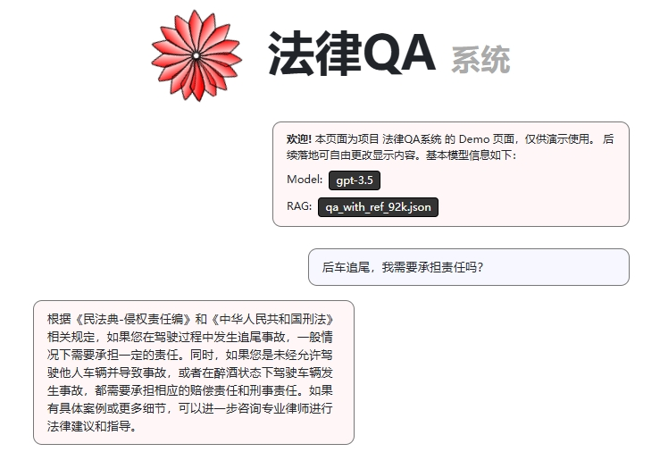

# 基于 RAG+GPT+Flask 的法律知识问答 Web系统

> **项目支持**：
>
> - Web Page -> [💬petals-infra/chat.petals.dev](https://github.com/petals-infra/chat.petals.dev)
> - Dataset -> 

## 界面预览



## 快速开始

1. `git clone` 或下载本项目（`raw_repo` 不必需）

2. 安装相关依赖库（懒人可直接 `pip install -r requirements.txt`）

3. 下载 `qa_with_ref_92k.json` 数据集至 `data` 目录

4. 启动 **Elasticsearch 服务端**程序（比如 Windows 系统是启动 `elasticsearch\bin\elasticsearch.bat`）

5. 运行 `python data_structures.py` 将数据集 embedding 到数据库（此过程耗时较久，数据库一旦构建此后该步骤可跳过）

6. 启动 Web app。在项目根目录运行：
    ```shell
    flask run --host=0.0.0.0 --port=5000
    ```

## 技术细节

### Database

`data_structures.py` 用于通过  [`bert-base-chinese`](https://huggingface.co/bert-base-chinese) 作为**嵌入模型**，为每一个数据集的字段编码得到embedding，并重新存储到 Elasticsearch 数据库中。该程序**只需运行一次**以构建数据库，此后无需运行。

### API

本项目使用 **websocket** 对路由 `/api/v2/generate` 进行请求，然后以 JSON 格式进行交互。

### Flask

使用 Flask 对前端三件套（HTML+CSS+JS）实现**数据传输**和**路由控制**。

- `app.py` 主程序，渲染主界面并指定 跨域支持 和 websocket (`ws`) 支持；
- `views.py` 用于指定渲染的 web page；
- `websocket_api.py` 用于处理 `ws` 请求，包括握手连接、对用户的输入进行 RAG prompt 处理，并以 JSON 的形式返还 `outputs`。

### JS

`static/chat.js` 文件用于实现对页面的动态更新，包括：

- 开启、刷新会话（实现 `ws` 的握手交互）；
- 响应收发信息请求 （实现 `ws` 交互的 JSON 数据解析和渲染）；
- 渲染“回复生成中...”的动态加载效果；
- 新增对话框以等待下一个用户请求的发送；
- 处理生成失败时的情况。


